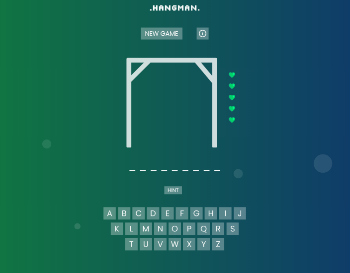
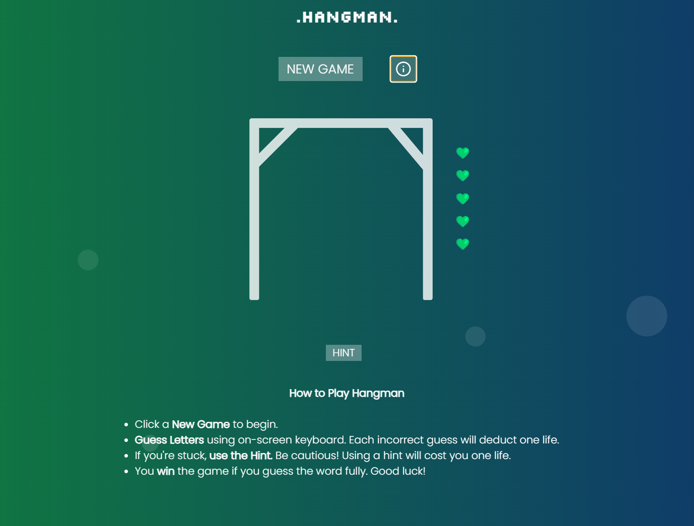
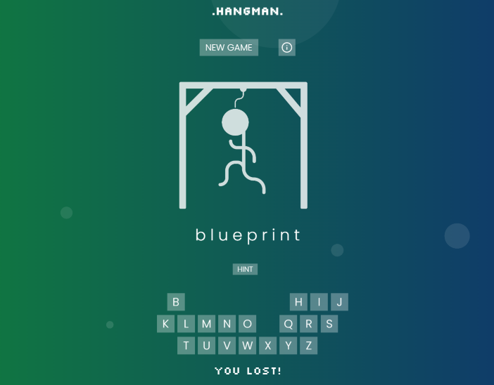

# **Hangman Game**

## **Introduction**

**Welcome to my Hangman Game**. This game is a _nology course project. Hangman is a web-based application where players guess letters to form a word. It features a user-friendly interface, hints, and a visual representation of the player's remaining lives. The project is also live, deployed on GitHub Pages.

[View Live Hangman](https://jm-go.github.io/game-project/)

## **Features**

- **Interactive Keyboard**: Easy letter selection for seamless gameplay.
- **Lives Display**: Tracks remaining lives.
- **Responsive Design**: Optimal viewing on various devices.
- **Hint Function**: Offers clues at the cost of a life.
- **End Game Messages**: Clear notifications for win or loss.
- **No Repeat Press**: Ensures letters are selected only once.

## **Technologies Used**

- **HTML5**: With semantic tags for structure.
- **CSS with SCSS**: For advanced styling.
- **BEM Methodology**: For organised and maintainable styling.
- **Vite**: Optimised frontend tooling.
- **TypeScript**: Adding interactivity and ensuring type safety.

## **Installation and Setup**

1. **Clone the repository** to your local machine.
2. **Navigate** to the project directory.
3. **Run `npm install`** to install dependencies.
4. **Start the development server** by running `npm run dev`.

Alternatively, view the live version deployed on GitHub Pages at [View Live Hangman](https://jm-go.github.io/game-project/).

## **File Structure**

Below is the file structure of the project.


```bash 
/src
├── assets/ 
├── data/
│ └── data.ts 
├── game/
│ ├── gameLogic.ts 
│ ├── ui.ts 
│ └── utils.ts 
├── styles/
│ ├── _animation.scss 
│ ├── _components.scss 
│ ├── _layout.scss 
│ └── _variables.scss 
├── main.ts 
├── main.scss 
├── README.md 
└── index.html 
```

## **Usage**

Open the web application in your browser. You will be presented with a game's interface. Here's how to use it:

1. **Starting the Game**: Click the **"New Game"** button to start a new game.

2. **Guessing Letters**: Use the on-screen keyboard to guess letters. Correct guesses reveal the letter; incorrect guesses remove one heart.

3. **Using Hints**: **"Hint"** button reveals a clue but costs one life. The hint button gets disabled after use to prevent repeated use in the same game.

4. **Tracking Lives**: Each incorrect guess results in the loss of one heart. Losing all hearts means game over.

5. **Winning the Game**: Win by guessing all letters in the mystery word correctly. "You won" message is displayed.

6. **Game Over**: The game ends if all lives are lost before guessing the word. "You lost" message is displayed, and the solution is revealed.

7. **Viewing Instructions**: Click the **"Info"** button to access game instructions. This action hides the keyboard and shows the instructions overlay. Click again to return to the game.

8. **Restart at Any Time**: A "New Game" button allows players to restart and initiate a new game at any moment.

## **Game Preview**

### New Game Interface

*The main interface of the game showing the hangman, word to guess, keyboard, and lives.*

### Show Info Example

*Example of the show info scenario, game's instructions overlay the keyboard section.*

### Gameplay Example - Player's Failure

*Example of the failure scenario, showcasing the keyboard interaction and displayed solution.*


## **Licence**

This project is open-source.

## **Contact**

For any additional questions or comments, feel free to reach out to me directly through the contact information provided on the website.

## **Acknowledgements**

Special thanks and acknowledgements go to the creator of the images used in this project.
